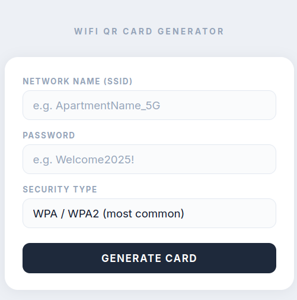
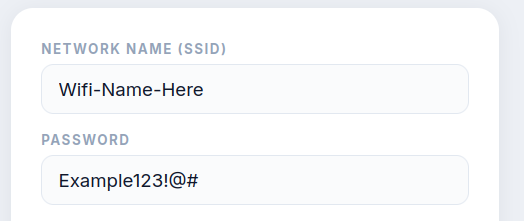
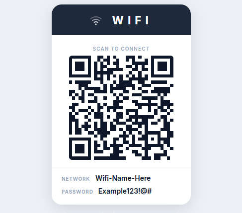
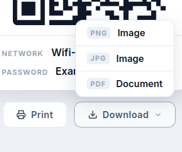
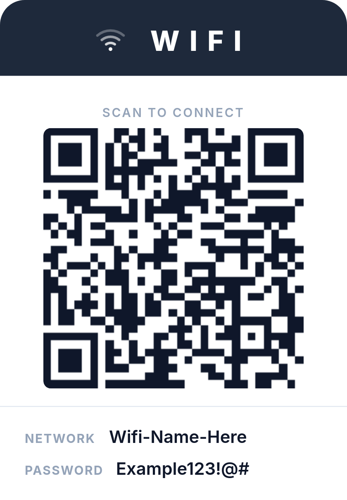

# 📶 WiFi QR Card Generator

> A clean, single-file HTML tool that generates printable WiFi QR cards — perfect for Airbnb hosts and short-term rental properties.


---

<!-- ============================================================
     HERO SCREENSHOT
     Replace the image below with a full screenshot of the app.
     Suggested size: 1200 × 700 px
     Save to: ./screenshots/hero.png
     ============================================================ -->



---

## ✨ Features

- **Instant QR generation** — works entirely offline, no server or internet needed
- **Printable WiFi card** — framed layout with a WIFI header, scannable QR code, and credentials at the bottom
- **Three download formats** — export as PNG, JPG, or PDF with one click
- **High-resolution output** — cards are captured at 3× scale for crisp prints
- **WPA / WPA2, WEP, and open networks** all supported
- **Zero setup** — just open the `.html` file in any modern browser

---

## 📸 Screenshots

<!-- ============================================================
     SCREENSHOT GRID
     Replace each image below with your own screenshots.
     Suggested size: 600 × 400 px per image
     Save to: ./screenshots/
     ============================================================ -->

<table>
  <tr>
    <td align="center" width="50%">
      <br/>
      <sub><b>① Enter your WiFi credentials</b></sub>
    </td>
    <td align="center" width="50%">
      <br/>
      <sub><b>② Instant card preview</b></sub>
    </td>
  </tr>
  <tr>
    <td align="center" width="50%">
      <br/>
      <sub><b>③ Choose your export format</b></sub>
    </td>
    <td align="center" width="50%">
      <br/>
      <sub><b>④ Print or display for guests</b></sub>
    </td>
  </tr>
</table>

---

## 🚀 Getting Started

No installation, no dependencies, no build step.

1. **Download** `index.html`
2. **Open** it in any modern browser (Chrome, Firefox, Safari, Edge)
3. **Fill in** your network name (SSID), password, and security type
4. **Click** Generate Card
5. **Print** directly or **download** as PNG, JPG, or PDF

That's it.

---

## 🖨️ Usage

<!-- ============================================================
     USAGE GIF / VIDEO PREVIEW (optional)
     Replace the image below with an animated GIF walkthrough.
     Suggested size: 800 × 500 px
     Save to: ./screenshots/demo.gif
     ============================================================ -->


| Field | Description |
|---|---|
| **Network Name (SSID)** | The exact name of your WiFi network |
| **Password** | Your WiFi password |
| **Security Type** | WPA/WPA2 (most common), WEP, or None |

Once generated, the card shows a scannable QR code that connects guests instantly — no typing needed. Most phones (iOS 11+, Android 10+) can scan it directly from the camera app.

---

## 📤 Export Options

| Format | Best For |
|---|---|
| **PNG** | Sharing digitally or embedding in a welcome guide |
| **JPG** | Smaller file size, great for email attachments |
| **PDF** | Printing, archiving, or sending to a print shop |

---

## 🛠️ Tech Stack

| Library | Purpose |
|---|---|
| [qrcodejs](https://github.com/davidshimjs/qrcodejs) | QR code generation |
| [html2canvas](https://html2canvas.hertzen.com/) | Card-to-image capture |
| [jsPDF](https://github.com/parallax/jsPDF) | PDF export |
| [Inter](https://fonts.google.com/specimen/Inter) | Typography (Google Fonts) |

All libraries are loaded via CDN — no `npm install` required.

---

## 🔤 WiFi QR Code Format

The tool generates industry-standard WiFi QR strings:

```
WIFI:T:<security>;S:<ssid>;P:<password>;;
```

**Example:**
```
WIFI:T:WPA;S:MyApartment_5G;P:Welcome2025!;;
```

Special characters (`\`, `;`, `,`, `"`, `:`) are automatically escaped per the spec.

---

## 📁 Project Structure

```
wifi-qr-generator/
│
├── wifi-qr-generator.html   # The entire app — single self-contained file
│
└── screenshots/             # Add your own screenshots here
    ├── hero.png
    ├── form.png
    ├── card-preview.png
    ├── download-menu.png
    ├── printed-card.png
    └── demo.gif
```

---

## 🤝 Contributing

Contributions, bug reports, and feature requests are welcome!

1. Fork the repository
2. Create a feature branch (`git checkout -b feature/your-idea`)
3. Commit your changes (`git commit -m 'Add your idea'`)
4. Push to the branch (`git push origin feature/your-idea`)
5. Open a Pull Request

---

## 📄 License

This project is licensed under the **MIT License** — free to use, modify, and distribute.

---

<p align="center">Made for Airbnb hosts who just want guests on the WiFi ✌️</p>
